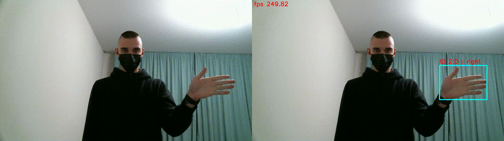
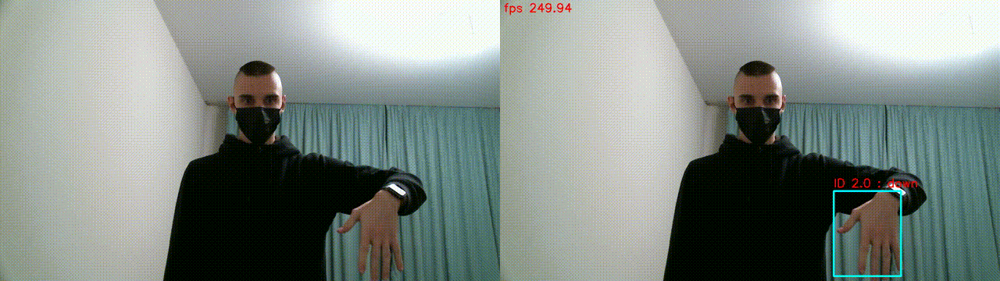
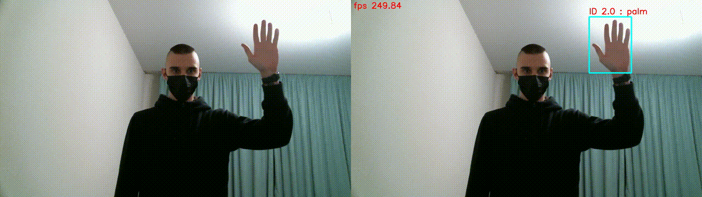
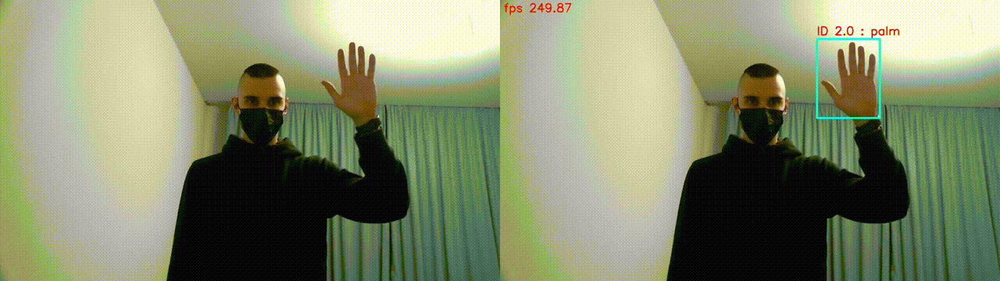

# HaGRID Dynamic Gestures
[HaGRID main repo](https://github.com/hukenovs/hagrid)

## Overview
This repository contains using HaGRID dataset for dynamic gesture recognition. The dataset is available [here](https://github.com/hukenovs/hagrid).

### Project

```
├── ocsort/ # source code for Observation-Centric Sorting
│   ├── kalmanfilter.py # Kalman filter
│   ├── kalmanboxtracker.py # Kalman box tracker
│   ├── association.py # Association of boxes with trackers
├── utils/ # useful utils
│   ├── action_controller.py # Action controller for dynamic gestures
│   ├── box_utils_numpy.py # Box utils for numpy
│   ├── enums.py # Enums for dynamic gestures and actions
│   ├── hand.py # Hand class for dynamic gestures recognition
│   ├── drawer.py # Debug drawer
├── onnx_models.py # ONNX models for gesture recognition
├── main_controller.py # Main controller for dynamic gestures recognition, uses ONNX models, ocsort and utils
├── run_demo.py # Demo script for dynamic gestures recognition
```

## Installation
Clone and install required python packages:
```bash
git clone https://github.com/nagadit/hagrid-dynamic.git
# or mirror link:
cd hagrid
# Create virtual env by conda or venv
conda create -n dynamic_gestures python=3.9 -y
conda activate dynamic_gestures
# Install requirements
pip install -r requirements.txt
```

## Demo
To run demo, you need to download ONNX models from [here](https://drive.google.com/drive/folders/11OhbIS9SC0ULAxCn6S4FQNeCuuPWT53F?usp=share_link) and put them into `onnx_models` folder. Then run `run_demo.py` script.

```bash
python run_demo.py --detector <path_to_detector> --classifier <path_to_classifier> --debug (optional)
```

## Dynamic gestures
Next, we will show dynamic gestures in user mode and debug mode. In user mode, we show only the final result of dynamic gesture recognition. In debug mode, we show the result of each step of dynamic gesture recognition:
1. hand detection
2. hand tracking
3. gesture recognition
4. action recognition

At the moment the code supports 5 types of dynamic gestures:

#### SWIPE LEFT


#### SWIPE RIGHT


#### SWIPE UP


#### SWIPE DOWN


#### DRAG AND DROP


## Multi-hand dynamic gestures
Also, we support multi-hand dynamic gestures. For example, you can swipe left and right with drag and drop action. The code supports 5 types of dynamic gestures:


### License
This work is licensed under a variant of <a rel="license" href="https://www.apache.org/licenses/LICENSE-2.0">Apache License, Version 2.0</a>.
